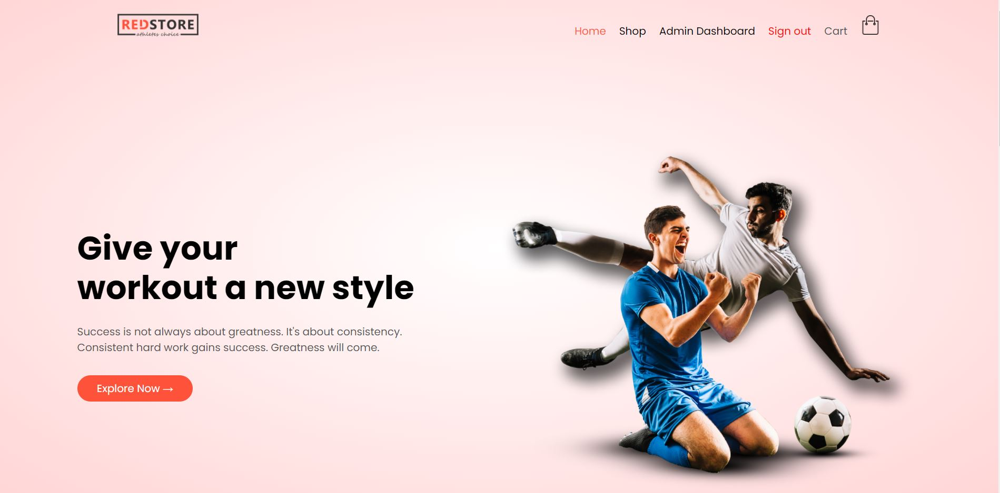

# RedStore
## Converting static HTML/CSS/JavaScript site to dynamic MERN stack web application

The main purpose of this project was to upgrade a static HTML/CSS site to a fully functioning eCommerce web application. The completed online store is simple to use and navigate, it supports user registration, user dashboard, shopping cart, sorting/filtering of products,  payment processing, etc. Additionaly, there is Admin dashboard which allows creating and managing database of all products in the store. 

To view functionality of the site you can easily register and login at https://mern.store, or use testing accounts: 
> user : user@user.com password: user123

> admin: admin@admin.com password: admin1

